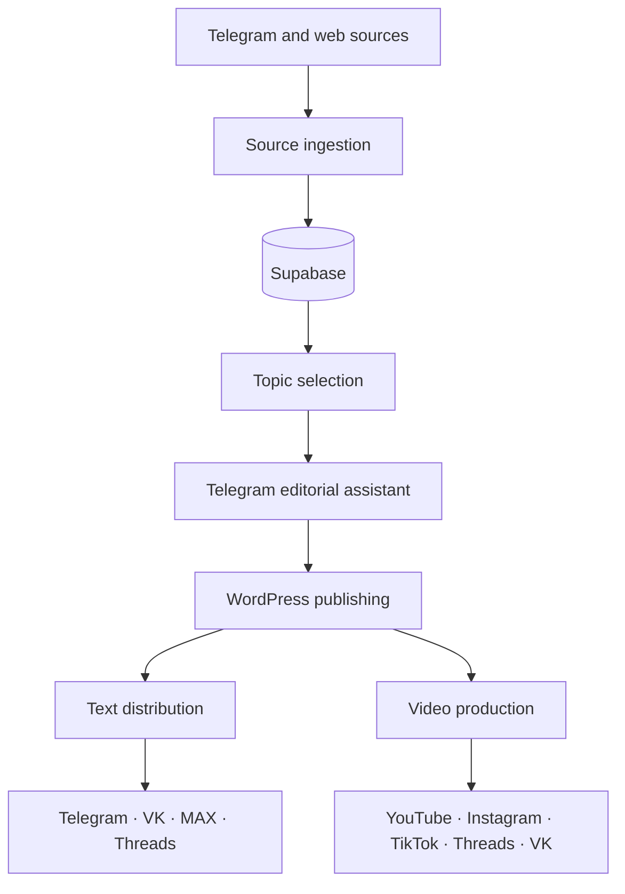

# AI Content Operations Platform

[](https://github.com/kdromanovich/ai-content-operations-platform/actions/workflows/validate.yml)

[Русская версия](README_RU.md) · [Architecture](docs/ARCHITECTURE.md) · [Setup](docs/SETUP.md) · [Data contracts](docs/DATA_CONTRACTS.md)

A system of seven connected n8n workflows for collecting source material, preparing content, coordinating editorial approval, publishing articles, and distributing text and video across multiple channels.

## Overview

The platform covers the full content cycle:

1. Collect posts and articles from Telegram and websites.
2. Store normalized source material in Supabase.
3. Select topics and prepare an editorial digest with AI.
4. Create, edit, schedule, and approve drafts through Telegram.
5. Publish articles to WordPress.
6. Adapt and distribute text to Telegram, VK, MAX, and Threads.
7. Generate short videos with HeyGen and distribute them to YouTube, Instagram, TikTok, Threads, and VK.

## Architecture



Supabase stores source items, drafts, publication jobs, and video jobs. Telegram is used as the editor interface for review, scheduling, and approval.

## Included workflows

| File | Purpose |
| --- | --- |
| `01-telegram-source-ingestion.json` | Collect and normalize Telegram posts |
| `02-web-source-ingestion.json` | Read configured Telegram and website sources |
| `03-ai-topic-curation.json` | Build a seven-topic editorial digest |
| `04-telegram-editorial-assistant.json` | Manage drafts and approvals from Telegram |
| `05-wordpress-publishing-pipeline.json` | Prepare and publish WordPress articles |
| `06-multichannel-text-distribution.json` | Adapt and send text to four channels |
| `07-ai-video-production-distribution.json` | Generate and distribute short videos |

## Main features

- human approval before publication;
- database-backed draft and job state;
- duplicate protection for incoming content and publishing jobs;
- structured parsing of AI responses;
- asynchronous HeyGen status polling;
- video duration and file-size checks with FFmpeg;
- separate formatting rules for every destination;
- failure branches and editor notifications.

## Quick start

1. Import the files from `workflows/` into self-hosted n8n in numeric order.
2. Configure the credentials and variables listed in [SETUP.md](docs/SETUP.md).
3. Connect the sub-workflow nodes in workflow 04 to workflows 03 and 05.
4. Run the manual branches with the examples from `sample-data/`.
5. Review destination IDs, schedules, and webhook settings before activation.

The workflows were created for n8n `2.17.5`. Workflow 07 requires FFmpeg and a writable `/files` directory.

## Repository structure

```text
workflows/       n8n workflow files
sample-data/     example webhook payloads
docs/            architecture, setup, and data contracts
scripts/         local workflow checks
tests/           automated tests
```

## License

See [LICENSE](LICENSE).
