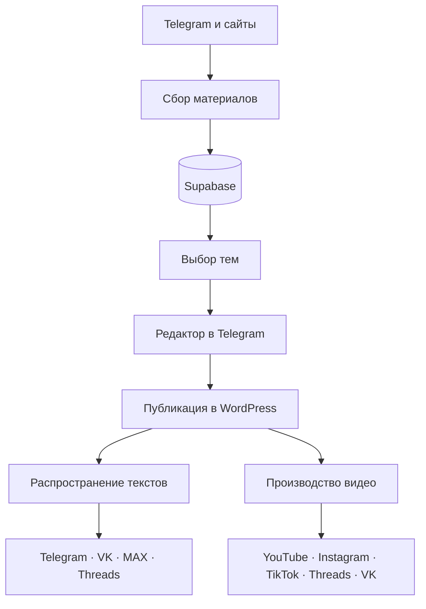

# AI-платформа производства и публикации контента

[English version](README.md) · [Архитектура](docs/ARCHITECTURE.md) · [Настройка](docs/SETUP.md) · [Структура данных](docs/DATA_CONTRACTS.md)

Система из семи связанных workflow n8n для сбора материалов, подготовки контента, редакционного согласования, публикации статей и распространения текстов и видео по нескольким площадкам.

## Что делает система

1. Собирает посты и статьи из Telegram и с сайтов.
2. Сохраняет нормализованные материалы в Supabase.
3. Выбирает темы и формирует редакционный дайджест с помощью AI.
4. Позволяет создавать, редактировать, планировать и согласовывать публикации через Telegram.
5. Публикует статьи в WordPress.
6. Адаптирует тексты для Telegram, VK, MAX и Threads.
7. Создаёт короткие видео через HeyGen и отправляет их в YouTube, Instagram, TikTok, Threads и VK.

## Архитектура



Supabase хранит исходные материалы, черновики и задания на публикацию. Telegram используется как интерфейс редактора для проверки, планирования и согласования.

## Workflow

| Файл | Назначение |
| --- | --- |
| `01-telegram-source-ingestion.json` | Сбор и обработка постов Telegram |
| `02-web-source-ingestion.json` | Получение материалов из настроенных источников |
| `03-ai-topic-curation.json` | Подготовка дайджеста из семи тем |
| `04-telegram-editorial-assistant.json` | Работа с черновиками и согласованиями |
| `05-wordpress-publishing-pipeline.json` | Подготовка и публикация статей WordPress |
| `06-multichannel-text-distribution.json` | Адаптация и отправка текстов |
| `07-ai-video-production-distribution.json` | Создание и распространение коротких видео |

## Основные возможности

- согласование перед публикацией;
- хранение состояния черновиков и заданий в базе данных;
- защита от повторной обработки;
- разбор структурированных ответов AI;
- ожидание результатов HeyGen без блокировки процесса;
- проверка длительности и размера видео через FFmpeg;
- отдельные правила оформления для каждой площадки;
- обработка ошибок и уведомления редактора.

## Запуск

1. Импортируйте файлы из `workflows/` в self-hosted n8n по порядку.
2. Добавьте credentials и переменные по инструкции [SETUP.md](docs/SETUP.md).
3. В workflow 04 укажите импортированные workflow 03 и 05.
4. Запустите ручные ветки с примерами из `sample-data/`.
5. Перед активацией проверьте ID каналов, расписания и webhook.

Система создавалась для n8n `2.17.5`. Для workflow 07 нужны FFmpeg и доступная для записи папка `/files`.

## Структура репозитория

```text
workflows/       файлы workflow n8n
sample-data/     примеры входных данных
docs/            архитектура, настройка и структура данных
scripts/         локальные технические проверки
tests/           автоматические тесты
```

## Лицензия

См. [LICENSE](LICENSE).
