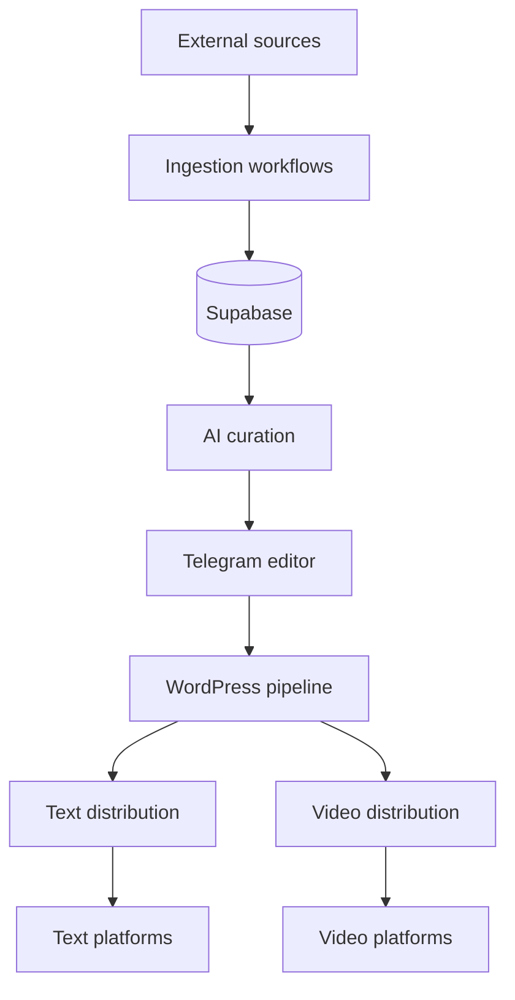
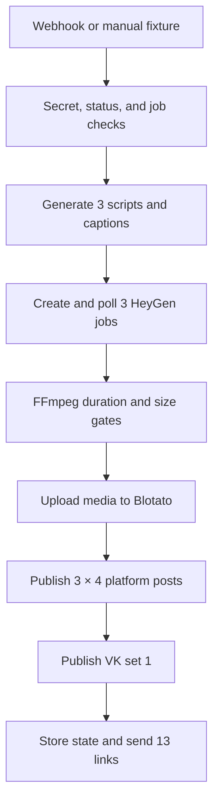

# Architecture

## System boundary

The system contains seven workflows connected through Supabase, Telegram, WordPress, and media-distribution services. Credentials and destination settings are configured after import.

## Module responsibilities

### 01 · Telegram Source Ingestion

Fetches public Telegram page HTML, extracts post elements, normalizes content and engagement fields, then performs a deduplicating bulk insert into the knowledge layer. Pagination state is updated until the configured batch is complete.

### 02 · Web Source Ingestion

Loads active sources and theme settings from Supabase, routes each source by type, parses Telegram pages or ordinary websites, cleans stale source content, and stores normalized records through a database RPC/API path.

### 03 · AI Topic Curation and Daily Digest

Loads recent unused content and editorial history, fetches four public RSS feeds, asks separate model steps to select database and RSS candidates, validates both outputs, builds a seven-topic digest, records the selection, and sends it to Telegram.

### 04 · Telegram Editorial Assistant

Acts as the human control plane. It checks the administrator, generates a draft from a source item and writing-style examples, stores the draft, handles callback buttons and reply edits, accepts standard or custom publication times, and invokes curation or WordPress sub-workflows.

### 05 · WordPress Publishing Pipeline

Polls queued publication records, marks work as processing, prepares title, description, keywords, slug, and HTML, selects a relevant Drive image, optionally transforms it through an AI image API, creates a pending WordPress post, attaches media, and writes success or failure state.

### 06 · Multichannel Text Distribution

Receives a WordPress webhook or manual fixture, verifies the publication state and image, acquires a duplicate lock, creates channel-specific text, posts to Telegram, VK, MAX, and Threads, retries Threads once, records results, and alerts the editor on retry failure.

### 07 · AI Video Production and Distribution

Validates the webhook, checks a Supabase idempotency record, generates three scripts and platform captions, creates three HeyGen jobs, polls each job, stops failed renders without another create request, downloads successful videos, applies FFmpeg constraints, uploads media to Blotato, publishes three content sets, adds one VK publication, stores final state, and returns 13 public links to Telegram.

## Video pipeline

## State ownership

| State | Owner | Used for |
| --- | --- | --- |
| Source registry and theme | Supabase | Selecting active inputs and editorial focus |
| Source content | Supabase | Deduplication and AI candidate selection |
| Draft | Supabase | Human editing, callback state, and scheduling |
| Publication job | Supabase | Queued / processing / published / failed lifecycle |
| Video job | Supabase | Webhook idempotency and final publication result |
| Telegram message | Telegram + stored ID | Editor interaction and message updates |
| Temporary media | `/files` volume | FFmpeg processing before external upload |

## Failure boundaries

- An empty ingestion result exits without creating database records.
- Invalid AI JSON is normalized and checked before use.
- Publication jobs are marked before external work and receive explicit success/failure updates.
- A duplicate webhook is skipped before expensive video generation.
- HeyGen pending states loop through a 90-second wait; a terminal failure stops without automatic regeneration to protect credits.
- Oversized or over-duration videos fail before distribution.
- A second Threads failure produces an editor alert instead of silent success.

## Deployment topology

The filesystem locks and media files assume a single self-hosted n8n environment with a persistent `/files` volume. For queue mode or multiple workers, move duplicate locks and temporary-object coordination to a shared database or object store.
